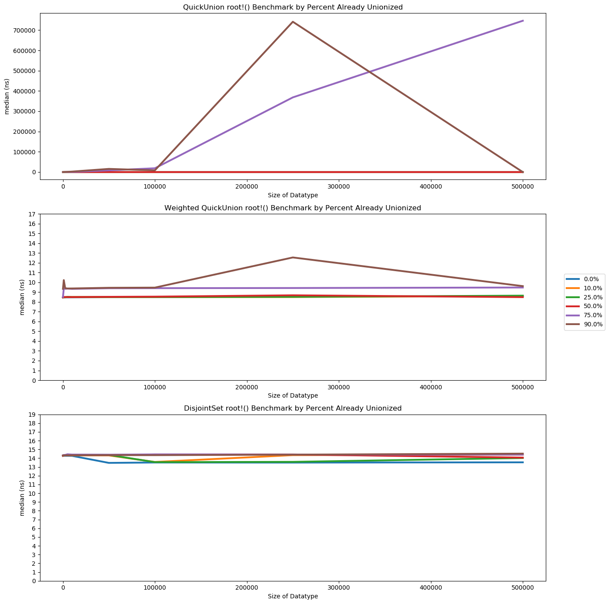
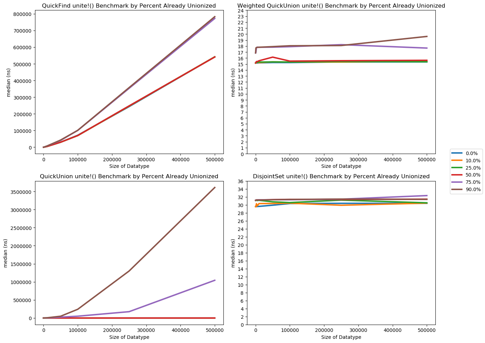
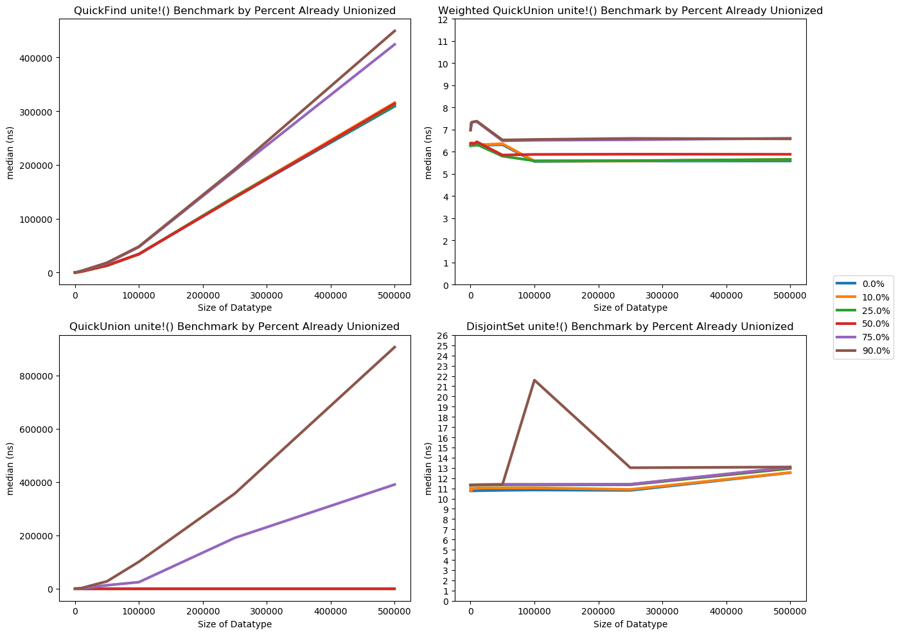

# UnionFind Implementations in Julia

Darius Russell Kish

#### Pre Introduction

To run the code. Install Julia according to https://julialang.org/downloads/ and https://julialang.org/downloads/platform/#macos. If you just want to confirm the benchmark runs, you do not need to install Jupyter Notebook support. Otherwise, https://datatofish.com/add-julia-to-jupyter/ – you should already have installed Julia so you can skip that step.

The benchmark relies on a number of libraries. In the command line, start up a Julia repl by typing "julia," assuming Julia is in your path. You can do this from anywhere at this point. Run:

```
using Pkg
Pkg.add("BenchmarkTools")
Pkg.add("StatsBase")
Pkg.add("JLD")
Pkg.add("PyPlot")
```

and exit. You should now be good to go.

You can run the harness (modify the number of samples so that its run time is reasonable on a local machine, something like 1000 maybe to test functionality. A JLD save of the 175,000 sample run will be available if desired. It will be a large file, thus not available on GitHub) using:

```bash
julia -O3 Harness.jl
```

You can analyze a run output using the "Test_Harness" Jupyter Notebook. You just start Jupyter Notebook as usual using "jupyter notebook Test_Harness.ipynb" and it should load. Make sure the kernel is set to Julia 1.4 and then you can run through the notebook entries.

### Introduction

UnionFind algorithms provide functionality to determine if a collection of objects belong to the same set, and if not, to join their respective belonging sets together. Most rely on underlying efficient representations in lists of integers, with wrappers to provide bindings between the arbitrary collection type and their integer id in the underlying implementation. For the purposes of this study only the underlying integer implementation is considered as most binding implementations rely on hashing algorithms, which complicate the runtime analysis.

### Algorithm Designs

At a basic level, a UnionFind, also known as Disjoint-Set data structure supports two functions (here in OCaml typing):

* find id1 id2: integer -> integer -> boolean
* unite id1 id2: integer -> integer -> unit  

In certain implementations of the data structure the additional function:

* root id1: integer -> integer

is implemented as well.

Abstractly, when initialized with size *n*, it contains some collection of *n* disjoint sets with one *id* value in each set. Some mutable definitions allow adding new values into the data structure as new disjoint sets in the collection. We will not consider this case as it is a trivial extension of the immutable underlying collection case.

See Julia code for full implementations. They do not differ significantly from the steps described here.

#### QuickFind

The QuickFind implementation necessitates only an indexable collection, *ids*, initialized to their index value to function. It creates a flat forest where the value of *ids[id]* is the root of the tree. Two *id* values are in the same set if they share the same root. *Find* is trivially implemented as *ids[id1] == ids[id2]*, which is an obvious O(1) lookup. *Unite* is implemented by setting all *ids[i] == ids[id1]* to *ids[id2]*, which requires O(n) time to loop through all indices in the collection.

```julia
ids = collect(1:n)

function find(id1, id2) # O(1)
  ids[id1] == ids[id2] # O(1)
end

function unite(id1, id2) # O(1)
  id = ids[id1] # O(1)
  for i = 1:n # O(n)
    if ids[i] == id
      ids[i] = ids[id2] # O(1)
    end
  end
 end
```

#### QuickUnion

Similarly, the QuickUnion implementation still only needs an indexable collection, *ids*, initialized to their index value. However, instead of maintaining a flat forest it allows creation of unrestricted forests. *Root* traverses *ids[id]* until it does not change, signaling it has traveled up the tree to the root. *Find* compares two *id*s by their root value. *Unite* finds the root of *r1 =ids[id1]* and *r2 = ids[id2]*, then setting *ids[r1] = r2*. This appends the two trees at their roots.

For runtime analysis, we must consider the case where tree appends occur such that it builds a chain of length *n*. A *find* operation on the last tree node would take *n* iterations to reach the root, so *find* is O(n). Since *unite* calls *find* a constant of 2 times, it also runs in O(n) time.  

```julia
ids = collect(1:n)

function root(id)
  root = ids[id] # O(1)
  while root != ids[root] # O(n)
    root = ids[root] # O(1)
  end
  return root
end

function find(id1, id2) # O(n)
  root(id1) == root(id2) # O(2n)
end

function unite(id1, id2) # O(n)
  r1 = root(id1) # O(n)
  r2 = root(id2) # O(n)
  ids[r1] = r2 # O(1)
end
```

#### Weighted QuickUnion

Weighted QuickUnion introduces a second indexable collection of integers that track the sizes of subtrees in the forest. When merging two trees, the smaller tree is merged into the larger tree. This inherently balances the trees in the forest and the maximum depth is *log(n)*, so *root* takes at most *log(n)* iterations. Both *find* and *unite* are reduced from O(n) to O(log(n)).

```julia
function unite(id1, id2) # O(log(n))
  r1 = root(id1) # O(log(n))
  r2 = root(id2)

  if pid == tid #prevents weight doubling when both roots are equal
    return uf.nGroups
  end

  # section ensure tree balancing
  if weights[r1] < weights[r2]
    ids[r1] = r2
    weights[r2] += weights[r1]
  else
    ids[r2] = r1
    weights[r1] += weights[r2]
  end
end
```

#### Weighted QuickUnion with Path Compression

We can form path compression on the trees every time we call *root*, which will loop through the path from *id* to its root and relink every node directly to root. This has a difficult affect on runtime analysis. It is no longer strictly polynomial in n, rather we can gain a better understanding of the runtime using amortized analysis, where we look at big Θ instead of big O time complexity. While much more complex analyses of the path compression can be used, we will use their very close approximates by recognizing the inverse ackerman function is less than 5 for any n in the range of and unsigned 64 bit integer. We can very closely approximate Θ(ack(n)) as Θ(1). For significantly large n, issues of caching and memory access will take over before "tighter" bounds in Θ(ack(n)) is relevant.

Every time we call root, it generates a path from *id* to *root*. This path may be of size greater than *k* >=1, in which case we take *k* steps to relink all nodes in the path to the root. However, after sufficient calls to *root*, the trees in the forest have been flattened, so all calls to *root* after this point take constant time assuming no new *unite*s. This is not strictly O(1), however it is Θ(1) time. Or more specifically O(ack(n)) where ack(n) is guaranteed to be less than 5 for any n in the range of and unsigned 64 bit integer. Thus, while we cannot further optimize the big O time complexity of this data structure, we can optimize its average time complexity through path compression.

```julia
function root(id)
  root = ids[id] # O(1)
  while root != ids[root] # it's complicated see path compression
    root = ids[root] # O(1)
  end

  while x != root # path compression – ack(n) < 5 guaranteed for UInt64 max ~ Θ(1)
        next = ids[x]
        ids[x] = root
        x = next
    end
  return root
end
```


## Benchmarking

Julia was chosen for its type system and optimizations into fast C code that avoids interaction with the runtime where possible. Additionally, Julia features a library called BenchmarkTools. Benchmarking is a notoriously difficult task, and BenchmarkTools attempts to aid in benchmarking best practices through their macros. Additionally, BenchmarkTools recommends comparing median times as they are robust with respect to outliers. We will use this convention.

Note: functions with a ! like *unite!()* is style convention to tell the user it modifies one or more of its arguments. Since most of the implementations modify the underlying UnionFind data structure, they have the bang convention.

Although not all implementations of the UnionFind data structure are dependent on the number of calls to *unite* that have occurred, all were tested at various levels of united-ness. To do so, embedded in the data structure implementations constant-time tracking of the number of disjoint sets was implemented. Thus, a 10% unionized UnionFind is defined as having the ratio 0.9 = *ngroups/n*. This allows for easy initialization through the following process:

```julia
function twoVals(n) # sample 2 values in [1, n] without replacement.
    s = sample(1:n, 2, replace = false)
    return (s[1], s[2])
end

function UnionFindSetup(n, frac)
    qf = UnionFind(n)

    while num_groups(qf) / length(qf) > 1-frac
        vals = twoVals(n)
        unite!(uf, vals[1], vals[2])
    end
    return qf
end
```

 This setup function will repeatedly select two random values in the valid range and unite them, until the desired proportion of unionization has occurred.

In QuickUnion this will randomly build trees resulting in average case results. It is not biased to produce worse than average case results, however since its tree structures are bounded by O(n) depth, we expect to see larger median times than the O(log(n)) bounded WeightedQuickFind.

In DisjointSet, anything beyond a proportion of 0 will have already had path compression performed in the setup, so it should display similarly Θ(1) behavior as expected.

A benchmarking run on the data structure roughly takes the form:

```julia
ns = [100, 1000, 2500, 5000, 10000, 50000, 100000, 250000, 500000]
percents = [0, 0.1, 0.25, 0.5, 0.75, 0.9]

for (nsi, n) in enumerate(ns), (pi, p) in enumerate(percents)
    rt = @benchmark root!(f[1], f[2][1]) setup =
        (f = (DisjointSetSetup($n, 1 - $p), twoVals($n)))
    benchmarkRootValuesDJU[nsi, pi] = rt

    ft = @benchmark find!(f[1], f[2][1], f[2][2]) setup =
        (f = (DisjointSetSetup($n, 1 - $p), twoVals($n)))
    benchmarkFindValuesDJU[nsi, pi] = ft

    ut = @benchmark unite!(f[1], f[2][1], f[2][2]) setup =
        (f = (DisjointSetSetup($n, 1 - $p), twoVals($n)))
    benchmarkUniteValuesDJU[nsi, pi] = ut
end
```

Here, the @benchmark macro allows for a setup step. This is run during every sample (in our case the ration of evaluations to samples is 1/1) and runs the setup code outside of profiling, before evaluating the tested function with the generated input. For all but QuickFind, whose runtime is independent of the underlying topology, we generate a new randomized %frac united UnionFind and the appropriate integer inputs to test on. All tree-based implementations share the same runtime between *find* and *unite*, so we do not bother checking if the two integers belong to the same set. Such a check is pointless in assessing performance since there is no real advantage to ensuring set-disjointness before calling unite. Unite has well-defined behavior when both integers belong to the same set.


#### Notes on Initial Data

These initial data were collected using 10,000 samples per function. As such, data structures of sizes above 100,000 do not have good representation in the benchmark due to the low sampling ratio. Timing constraints were, however, a factor in this initial benchmark. A much longer benchmark using 175,000 samples per function is currently underway and will be appended when done.

#### Initial Performance of root!()



**Figure 1:** In the QuickUnion implementation, large tree traversal times are observed when a large percentage of the data structure is unionized. Weighted QuickUnion, however, was observed to have much tighter bounds and performs approximately constant time. DisjointSet, which implements path compression, was observed to have very tight constant time bounds.

Poor sampling of the higher size data structures introduces significant noise into the data. However this isn't timing noise, rather an artifact of our tree data structure. Theoretical bounds put QuickUnion at O(n) as a worst case construction, however this case is rarely seen in practice. Additionally, only leaf nodes will perform require a full height traversal. Due to our sampling, there is a much lower proportion of leaf nodes hit in the larger data structure vales, thus biasing the observed median times low. This will be seen throughout the initial data. These benchmark values inherently measure average case values, not worst case. We should not expect to see their big O complexity directly represented in these initial data, especially in tree structures since their path lengths are dependent on tree construction and location, rather than a 1:n loop.

QuickUnion performs obviously worse than the Weighted QuickUnion and DisjointSet implementations. As explained above, we do not observe O(n) behavior. Below sizes of 100,000, it appears the data structure is able to fit inside fast memory. Above 100,000, it begins to scale with a much greater slope. At the largest size, 500,000, we theorize the sampling is significantly biasing the median time lower than its true average case. Increased sampling should hopefully give a clearer picture.

Weighted QuickUnion has a similar shape to QuickUnion, however it has much tighter performance. Most cases performed approximately constant, however the 90%-united case reveals that worse than constant time *root* operations exist. The average case in these data, however, is less than the worst case O(log(n)). Similar sampling noise is observed, further indicating the issue is systematic sampling bias rather than biases in implementations.

DisjointUnion displays amortized constant time as expected. All samples performed approximately within 1 ns of each other, which is beginning to push the accuracy of the timing functions and is likely noise. The larger data structures in higher percent-united cases display some bias higher, as expected from the path compression loop introducing constant multiplier according to ack(n), though this is still clearly Θ(1).

Sampling noise in the large data structure sizes makes conclusions of scaling difficult for DisjointSet and Weighted QuickUnion. Though we can say both perform much better than QuickUnion.

#### Initial Performance of find!()


**Figure 2:** QuickFind appears to have some noise at very small n but is otherwise approximately linear in all cases. QuickUnion similarly has poor sampling at large data structure sizes. It appears to scale at least proportional to the size of the data structure with higher percentage-united cases requiring more time on average. Weighted QuickUnion time grows with data structure size, however less than linearly. Higher percentage-united cases take more time to run on average. DisjointSet including path compression appears approximately linear with greater spread across percentage-united cases.

While QuickFind does not implement root, it does implement find and unite. The theoretical bound is O(1), which is very clearly observed in the data. Slightly higher times observed for larger data structure sizes are likely related to memory access overhead. This is still O(1) as the largest latency in the system can be used at the multiplier to bound this time growth.

QuickUnion appears at first glance to scale greater than O(n), however again this is likely due to changes in storage through cache levels to RAM. Low sampling bias is again observed at large data structure sizes. Weighted QuickUnion performs similarly to its *root*,  where the average case appears again to be approximately linear for these sample sizes. DisjointSet performs the same as its *root*, where it is constant across data structure size.

Sampling noise in the large data structure sizes makes conclusions of scaling difficult for DisjointSet and Weighted QuickUnion. Though we can again say both perform much better than QuickUnion.

#### Initial Performance of unite!()



**Figure 3:** QuickFind's *unite* performs scaling very close to linearly with respect to the size of the data structure. QuickUnion performs faster than QuickFind, though for large percentage-united cases near linear performance is observed. Weighted QuickUnion performs approximately linearly in these data, with the 90%-united case growing slightly with large data structure sizes. DisjointSet performs approximately linearly across its cases with some sampling noise in the large data structure sizes due to sample sizes.


QuickFind's implementation involves a for loop over 1:n for *all* calls to *unite*. Because of this, we expect the data to perform much closer to its O(n) bound, as its big Θ bound is also Θ(n). This is indeed what we observe, with small changed to the slope due to memory latency. QuickUnion performs better than QuickFind despite both having the same O(n) worst case, since QuickUnion has a big Θ < Θ(n). For large percentage-united cases, where chains become a valid concern, we do see linear scaling even in with the median, suggesting such randomly generated QuickUnion data structures exhibit significant chains when mostly merged. Weighted QuickUnion largely solves this issue, and with the initial sample size even appears to perform approximately constant. This is expected since chains are mitigated through balanced tree merges, where the worst case for a height traversal is O(logn(n)) < O(n), and the average case is likely even smaller. Disjoint Union similarly displays average constant time as expected.

Sampling noise in the large data structure sizes makes conclusions of scaling difficult for DisjointSet and Weighted QuickUnion. Though, we can say for *unite* that Weighted QuickUnion and Disjoint Union perform much better than QuickUnion and QuickFind despite this.

#### Conclusion

Despite following best practices for benchmarking, we still observe noise and biases in our sampling that make determining actual average case bounds for Weighted QuickUnion and DisjointSet difficult. Weighted QuickUnion often appears to perform in average constant time rather than somewhere between constant and log(n) time, and DisjointSet has noise that makes conclusively confirming it performs in average constant time from the data impossible. We can, however, conclusively say that *unite* for QuickFind is a slow, Θ(n) operation. And *find* and *unite* for QuickUnion perform clearly much worse than their Weighted QuickUnion and DisjointSet cousins. From a theoretical standpoint, DisjointSet performs better with much tighter bounds for its average case, essentially Θ(1), whereas Weighed QuickUnion still has a worst case of O(log(n)), even if its big Θ does not appear to come close to this. Only larger sampling will confirm this form a purely practical standpoint, however combining theoretical and practical analysis allows us to conclude DisjointSet is the most efficient implementation.

#### Long Benchmark Results

These were performed using 175,000 samples instead of 10,000. This was designed to help get better sampling of the large size data structures.


**Figure 4:** In the QuickUnion implementation, large tree traversal times are observed when a large percentage of the data structure is unionized. Weighted QuickUnion, however, was observed to have much tighter bounds and performs approximately constant time. DisjointSet, which implements path compression, was observed to have tight time bounds but as the data structure size increased, the time increases slightly.


**Figure 5:** QuickFind appears to have some noise at very small n but is otherwise approximately linear in all cases. QuickUnion similarly has poor sampling at large data structure sizes. It appears to scale at least proportional to the size of the data structure with higher percentage-united cases requiring more time on average. Weighted QuickUnion time remains approximately constant with data structure size, though a slight upwards slope is noted. Higher percentage-united cases take more time to run on average. DisjointSet including path compression appears approximately linear until the n=500,000 case, where the time rises in all cases.



**Figure 6:** QuickFind's *unite* performs scaling very close to linearly with respect to the size of the data structure. QuickUnion performs faster than QuickFind, though for large percentage-united cases near linear performance is observed. Weighted QuickUnion performs approximately linearly in these data. DisjointSet performs approximately linearly across its cases though an upwards trend for n=500,000 is noted.

**Conclusions**

Similar to the smaller case, the naive implementations performed poorly, nearly O(n). Surprisingly, Weighted QuickUnion performs extremely well for the data structure sizes tested. It has near linear performance which was unexpected, further suggesting its average case is constant and not Θ(log(n)) like its O(log(n)) worst case. In fact, from the data, the time it takes to perform path compression on large structure sizes is a constant multiplier worse than the average Weighted QuickUnion. This constant multiplier appears small and would not outweigh the benefit of guaranteed Θ(1) performance in DisjointSet versus relying on average case performance in Weighted QuickUnion.
